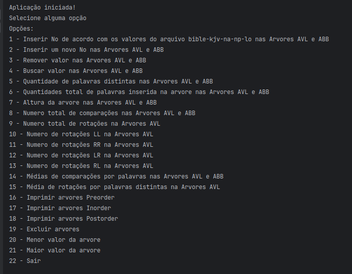

# Implementação e Comparação de Árvores AVL e ABB em Java

## Introdução
Este projeto visa implementar e comparar as estruturas de dados de Árvores AVL e Árvores Binárias de Busca (ABB) em Java. Essas estruturas são fundamentais para compreender algoritmos de busca e ordenação.

## Instalação
- Certifique-se de ter o Java instalado em sua máquina. [Download Java](link_para_download_do_Java)
- Versão utilizada do JDK durante o desenvolvimento: 21

## Para Executar
Certifique-se de que o JDK esteja instalado na sua máquina.
Execute o arquivo Main.java para iniciar a aplicação.

## Objetivos
Implementar uma classe para Árvores Binárias de Busca Balanceadas em Altura (Árvores AVL), com os seguintes métodos:
- Busca com inserção
- Busca
- Inserção
- Remoção
- Rotações LL
- Rotações RR
- Rotações LR
- Rotações RL

Cada método tem como objetivo fornecer funcionalidades específicas para manipular e equilibrar a árvore.

## Resultados
Os resultados são apresentados por meio de uma interface no console da aplicação, onde o usuário pode interagir com a estrutura da árvore e os métodos relacionados.

Exemplo de execução:

